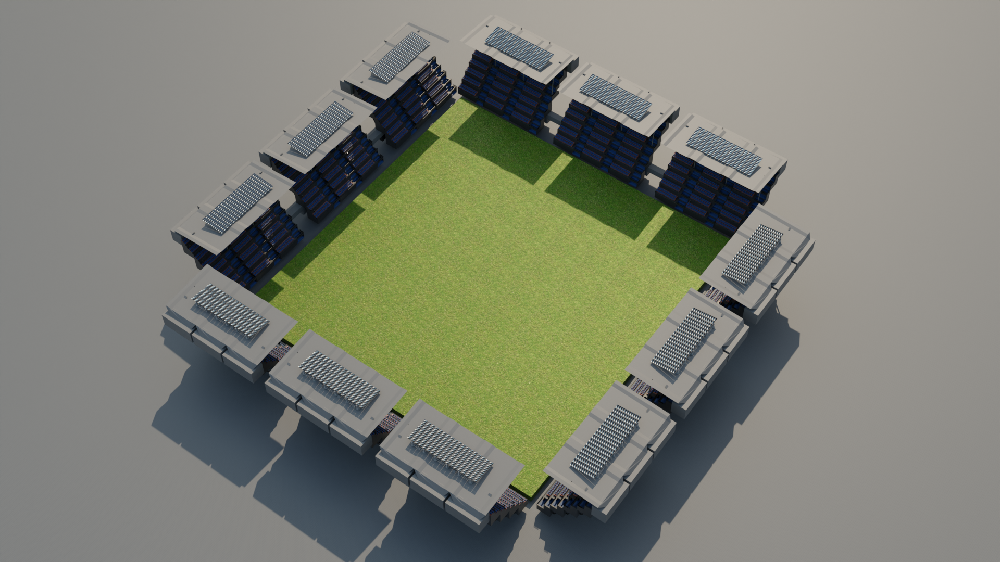

# Container Stadium Concept

A futuristic stadium concept designed entirely using modular shipping containers in Blender. The project explores sustainable and industrial-style architecture by transforming stacked shipping containers into a fully structured sports arena with seating sections, lighting platforms, and an open central field.

---

## Preview



---

## Features

* Stadium structure built completely from shipping containers
* Modular architectural design
* Open central sports field
* Seating sections and elevated platforms
* Industrial-inspired futuristic aesthetic
* Lightweight and scalable concept design
* Clean geometric modeling

---

## Included Files

```txt id="m6rxo5"
container-stadium/
│
├── container-stadium.glb
├── container-stadium.fbx
├── render-1.png
├── render-2.png
└── source/
    └── container-stadium.blend
```

---

## Formats

| Format   | Purpose                                   |
| -------- | ----------------------------------------- |
| `.glb`   | Web visualization and interactive viewers |
| `.fbx`   | Unity, Unreal Engine, and 3D software     |
| `.blend` | Original Blender source project           |

---

## Software Used

* Blender

---

## Project Details

* Category: Architectural Visualization
* Style: Industrial / Futuristic
* Theme: Sustainable Modular Architecture
* Rendering Engine: Cycles / Eevee
* Suitable For:

  * Concept visualization
  * Game environments
  * Architectural experiments
  * Portfolio showcases

---

## Design Highlights

* Repeated modular container structures
* Symmetrical stadium layout
* Minimalistic industrial appearance
* Efficient geometric workflow
* Expandable architectural concept

---

## Future Improvements

* Detailed audience seating
* Interior stadium facilities
* Night lighting version
* Animated crowd simulation
* Realistic materials and textures

---

## Author

Created by Tejwardeep Singh
