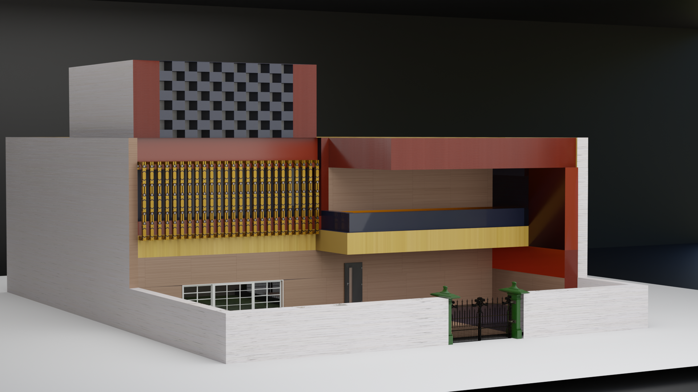

# Modern Residential House Concept

A modern residential house concept designed and rendered in Blender, featuring a clean geometric structure, layered architectural elements, decorative facade detailing, and a contemporary urban aesthetic. The project focuses on modern home design principles, balanced color composition, and minimalist architectural styling.

---

## Preview



---

## Features

* Modern residential architecture
* Decorative front facade design
* Layered balcony structure
* Minimalistic geometric composition
* Boundary wall and entrance gate
* Contemporary urban house styling
* Optimized architectural modeling workflow

---

## Included Files

```txt id="7c1f2m"
modern-residential-house/
│
├── modern-residential-house.glb
├── modern-residential-house.fbx
├── render-1.png
├── render-2.png
└── source/
    └── modern-residential-house.blend
```

---

## Formats

| Format   | Purpose                                   |
| -------- | ----------------------------------------- |
| `.glb`   | Web visualization and interactive viewers |
| `.fbx`   | Unity, Unreal Engine, and 3D software     |
| `.blend` | Original Blender source project           |

---

## Software Used

* Blender

---

## Project Details

* Category: Architectural Visualization
* Style: Modern Residential Architecture
* Theme: Urban Home Design
* Rendering Engine: Cycles / Eevee
* Suitable For:

  * Portfolio showcases
  * Architectural visualization
  * Game environment assets
  * Residential concept presentations

---

## Design Highlights

* Clean modern facade
* Balanced material and color composition
* Contemporary balcony layout
* Decorative architectural patterns
* Symmetrical front elevation

---

## Future Improvements

* Interior environment design
* Realistic material texturing
* Night lighting version
* Environmental landscaping
* Animated walkthrough render

---

## Author

Created by Tejwardeep Singh
