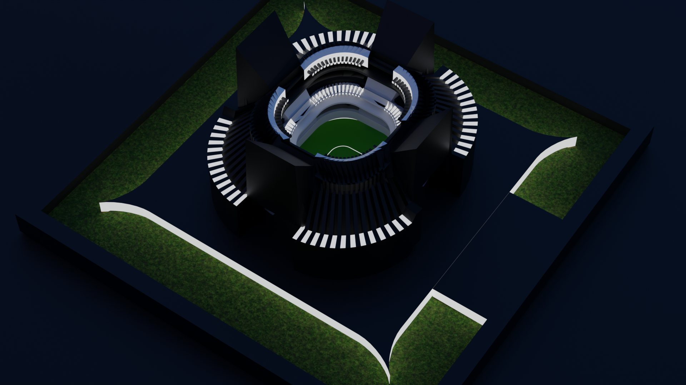

# Futuristic Cricket Stadium Concept

A futuristic cricket stadium concept designed and rendered in Blender, featuring a circular multi-tier seating arrangement, integrated tower structures, dramatic architectural forms, and a modern sports arena aesthetic. The project combines contemporary stadium design principles with a bold sci-fi-inspired architectural language.

---

## Preview



---

## Features

* Futuristic cricket stadium architecture
* Multi-tier spectator seating
* Central cricket playing field
* Integrated tower structures
* Circular and symmetrical layout
* Modern sports infrastructure concept
* Clean geometric modeling
* Night visualization ready

---

## Included Files

```txt
futuristic-cricket-stadium/
│
├── futuristic-cricket-stadium.glb
├── futuristic-cricket-stadium.fbx
├── render-1.png
├── render-2.png
├── render-3.png
└── source/
    └── futuristic-cricket-stadium.blend
```

---

## Formats

| Format   | Purpose                                     |
| -------- | ------------------------------------------- |
| `.glb`   | Web visualization and Three.js projects     |
| `.fbx`   | Unity, Unreal Engine, and other 3D software |
| `.blend` | Original Blender source project             |

---

## Software Used

* Blender

---

## Project Details

* Category: Sports Architecture
* Style: Futuristic Architecture
* Theme: Cricket Stadium
* Rendering Engine: Cycles / Eevee
* Design Type: Concept Visualization

---

## Architectural Highlights

### Circular Arena Design

The stadium follows a radial layout that maximizes visibility from all spectator sections while creating a visually striking form.

### Multi-Level Seating

The structure incorporates multiple seating tiers surrounding the central cricket field, inspired by modern international cricket venues.

### Integrated Tower Elements

Large vertical architectural elements provide a unique identity to the stadium while enhancing its futuristic appearance.

### Symmetrical Planning

The stadium is designed with balanced geometry and uniform circulation pathways to maintain structural harmony.

### Night-Time Presence

The dark exterior combined with illuminated pathways and seating accents creates a powerful visual impact during evening events.

---

## Suitable For

* Architectural portfolios
* Stadium design concepts
* Sports infrastructure visualization
* Game environments
* Urban development projects
* Sci-fi world building

---

## Design Goals

* Reimagine cricket stadium architecture
* Explore futuristic sports venue concepts
* Create a recognizable landmark structure
* Blend functionality with visual identity
* Experiment with large-scale circular forms

---

## Future Improvements

* Detailed spectator seating
* Floodlight system
* Scoreboards and media facilities
* Realistic material texturing
* Crowd simulation
* Animated flythrough
* Match-day lighting setup

---

## Author

Created by Tejwardeep Singh

Part of the **3D Model Library** collection.
