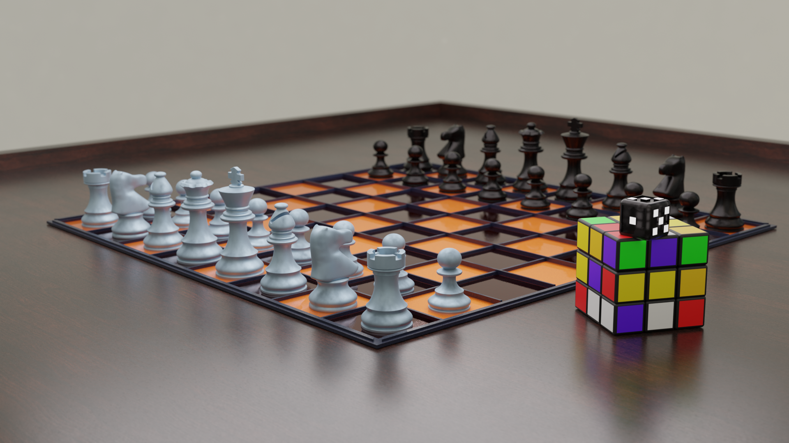

# Chess Board & Rubik’s Cube Render

A realistic 3D render created in Blender featuring a stylized chess board setup paired with a colorful Rubik’s Cube on a polished wooden surface. The scene focuses on cinematic composition, material realism, reflections, and depth of field rendering.

---

## Preview



---

## Features

* Detailed chess pieces and board
* High-quality Rubik’s Cube model
* Realistic wooden surface reflections
* Cinematic lighting setup
* Depth of field camera effects
* Smooth and optimized geometry
* Physically based materials

---

## Included Files

```txt
chess-board-scene/
│
├── chess-board-scene.glb
├── chess-board-scene.fbx
├── render-1.png
├── render-2.png
└── source/
    └── chess-board-scene.blend
```

---

## Formats

| Format   | Purpose                                  |
| -------- | ---------------------------------------- |
| `.glb`   | Web visualization and Three.js           |
| `.fbx`   | Unity, Unreal Engine, and other software |
| `.blend` | Original Blender source project          |

---

## Software Used

* Blender

---

## Scene Details

* Category: Props / Tabletop Scene
* Style: Realistic Render
* Rendering Engine: Cycles / Eevee
* Suitable For:

  * Portfolio projects
  * Game environments
  * Product visualization
  * Rendering practice

---

## Rendering Highlights

* Soft cinematic lighting
* Realistic reflections and shadows
* Depth of field composition
* Material detailing and polished surfaces

---

## Future Improvements

* Animated chess gameplay
* Improved texture detailing
* Interactive web viewer support
* Additional environment props

---

## Author

Created by Tejwardeep Singh
