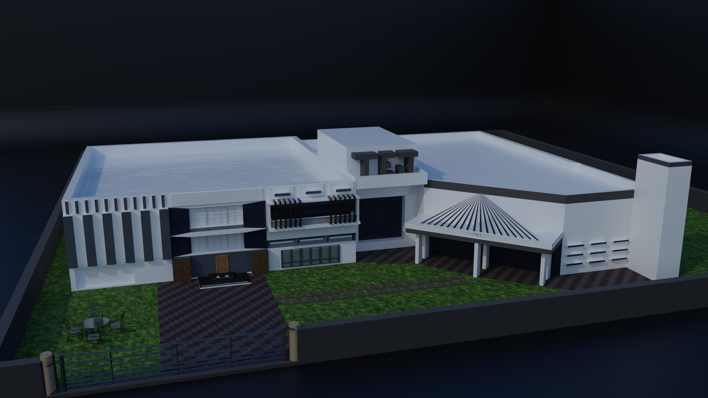

# Modern House Exterior Model

A modern architectural 3D house model created in Blender, featuring a contemporary residential design with exterior detailing, landscaping, boundary walls, and realistic lighting renders.

---

## Preview



---

## Features

- Modern residential architecture
- Detailed exterior modeling
- Boundary walls and front gate
- Grass landscaping and pathways
- Realistic night lighting setup
- Clean and organized topology
- Optimized for rendering and visualization

---

## Included Files

```txt
modern-house/
│
├── modern-house.glb
├── modern-house.fbx
├── render-1.png
├── render-2.png
└── source/
    └── modern-house.blend
```

---

## Formats

| Format | Purpose |
|---|---|
| `.glb` | Web and Three.js projects |
| `.fbx` | Unity, Unreal Engine, and 3D software |
| `.blend` | Original Blender source file |

---

## Software Used

- Blender

---

## Model Details

- Style: Modern Architecture
- Type: Residential Building
- Category: Architectural Visualization
- Rendering Engine: Cycles / Eevee
- Suitable For:
  - Architectural renders
  - Web visualization
  - Game environments
  - Portfolio showcases

---

## Usage

You are free to use this model according to the repository license.

---

## Future Improvements

- Interior detailing
- PBR texture enhancements
- Daylight render variations
- Animation walkthrough

---

## Author

Created by Tejwardeep Singh