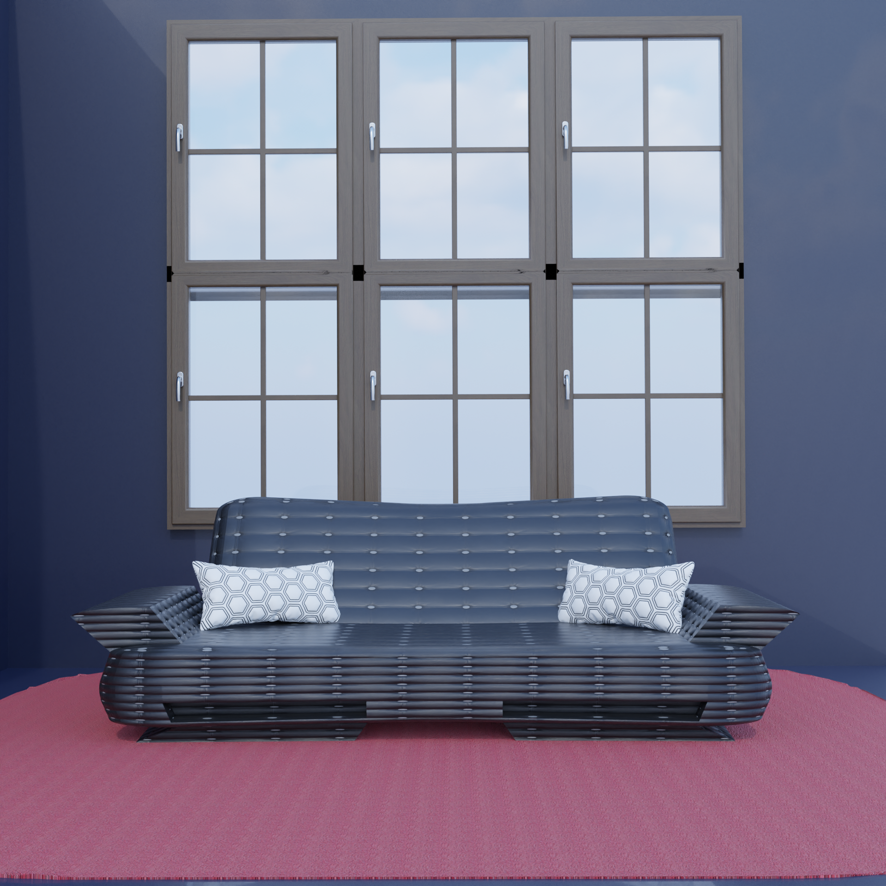

# Modern Sofa Interior Scene

A photorealistic 3D interior visualization featuring a contemporary sofa setup in a minimalist living room. This project focuses on clean composition, realistic lighting, high-quality materials, and modern furniture design.



---

## ✨ Features

- Modern sofa design
- Minimalist interior environment
- Realistic lighting and shadows
- Wooden framed windows
- Fabric rug and decorative cushions
- High-quality materials and textures
- Rendered using physically based rendering (PBR)

---

## 📷 Preview

The scene includes:

- Contemporary black leather sofa
- Decorative pillows
- Wooden-framed windows
- Soft indoor lighting
- Minimalistic room setup
- Clean architectural composition

---

## 🛠 Software Used

- Blender
- Cycles / Eevee (depending on render settings)

---

## 📂 Project Structure

```
.
├── sofa.blend
├── sofa.png
├── README.md
└── LICENSE
```

---

## 🎯 Purpose

This project was created to practice and showcase:

- 3D Modeling
- Material Creation
- Lighting
- Interior Visualization
- Rendering Techniques

---

## 📌 Future Improvements

- HDRI lighting setup
- Additional furniture
- Animated camera walkthrough
- Procedural materials
- Realistic outdoor environment
- Better post-processing

---

## 👨‍💻 Author

**Tejwardeep Singh**

Computer Science Engineering Student  
3D Artist | Full Stack Developer | Unity Developer

GitHub: https://github.com/Tejwardeep-Singh

---

## ⭐ Support

If you like this project, consider giving it a ⭐ on GitHub.